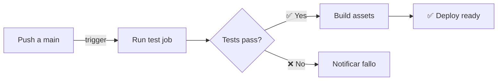
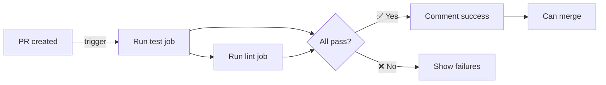

# CI/CD Pipeline - GitHub Actions

## 📌 Overview

Offside Club utiliza **GitHub Actions** para automatizar tests y validaciones cada vez que:
- Se hace **push** a `main` o `develop`
- Se crea un **pull request** hacia `main` o `develop`

## 🔄 Workflow: `run-tests.yml`

Ubicación: `.github/workflows/run-tests.yml`

### Jobs ejecutados

#### 1. **test** - PHP Unit & Feature Tests
Ejecuta en **ubuntu-latest** con MySQL 8.0

**Pasos:**
1. ✅ Checkout del código
2. ✅ Setup PHP 8.3 + extensiones necesarias
3. ✅ Install Composer dependencies
4. ✅ Setup Node.js 20 + npm
5. ✅ Setup .env para testing
6. ✅ Generate app key
7. ✅ Wait for MySQL ready
8. ✅ Run database migrations
9. ✅ **Execute PHP tests** (parallelizado)
10. ✅ Build assets (Vite)
11. ✅ Upload test reports

**Configuración de BD:**
```yaml
db_database: offside2_test
db_username: root
db_password: root
```

**Comandos principales:**
```bash
php artisan migrate --env=testing
php artisan test --parallel --no-coverage
npm run build
```

#### 2. **lint** - Code Quality Checks
Ejecuta validaciones de estilo

**Pasos:**
1. ✅ Setup PHP 8.3
2. ✅ Install Composer dependencies
3. ✅ Run **Pint** (Laravel formatter)
4. ✅ TypeScript linting (opcional)

## 🎯 Flujo según evento

### En PUSH a `main` o `develop`


### En PULL REQUEST


**Resultado en PR:**
```
✅ All checks passed
  - test: ✓ PHP tests passed
  - lint: ✓ Code quality OK
  - build: ✓ Assets built successfully
```

## 📊 Configuración Detallada

### Variables de Entorno para Tests
```env
APP_ENV=testing
DB_CONNECTION=mysql
DB_HOST=127.0.0.1
DB_DATABASE=offside2_test
DB_USERNAME=root
DB_PASSWORD=root

# API Keys (Mock)
GEMINI_API_KEY=test_gemini_key_12345
FOOTBALL_DATA_API_KEY=test_football_api_key_12345
OPENAI_API_KEY=test_openai_key_12345

# Drivers
CACHE_DRIVER=array
QUEUE_CONNECTION=sync
SESSION_DRIVER=array
```

### MySQL Service Configuration
```yaml
image: mysql:8.0
environment:
  MYSQL_ROOT_PASSWORD: root
  MYSQL_DATABASE: offside2_test
healthcheck:
  cmd: mysqladmin ping
  interval: 10s
  timeout: 5s
  retries: 3
```

### PHP Extensions
```yaml
- mbstring (String manipulation)
- pdo (Database)
- pdo_mysql (MySQL driver)
- bcmath (Calculations)
- ctype (Character checking)
- json (JSON)
- tokenizer (Code parsing)
```

### Coverage Requirements
```bash
# Mínimo coverage requerido
php artisan test --coverage --min=70

# Solo en PRs (fail pero no bloquea)
```

## 🔑 Secrets & Credentials

GitHub Actions usa variables de repositorio definidas en:
`Settings → Secrets and variables → Actions`

**No se requieren secrets** para tests (usan valores mock en `.env.testing`)

## 📈 Monitoreo de Workflow

### Ver estado en GitHub UI
1. Ve a repository
2. Click en **Actions** tab
3. Selecciona workflow `Run Tests`
4. Verifica run más reciente

### En PR
Verifica debajo del título del PR:
```
✓ test
✓ lint
```

### Badges en README
```markdown
[](https://github.com/rodrigocardenas/offside-app/actions/workflows/run-tests.yml)
```

## 🐛 Troubleshooting

### Tests fallan en CI pero pasan localmente
**Causas comunes:**
- Diferencia en versiones (PHP, MySQL)
- Variables de entorno faltantes
- Permisos de archivos

**Solución:**
```bash
# Verifica .env.testing
cat .env.testing

# Simula ambiente CI localmente
php artisan test --env=testing
```

### MySQL connection timeout
**Error:** `SQLSTATE[HY000]: General error: 2006 MySQL has gone away`

**Solución en workflow:**
```yaml
# El workflow ya incluye health check
services:
  mysql:
    options: >-
      --health-cmd="mysqladmin ping"
      --health-interval=10s
```

### Pasos quedan pendientes
**Causa:** Timeout o recurso insuficiente

**Solución:**
- Aumenta timeout: `timeout-minutes: 15`
- Reduce tests paralelos: `php artisan test --parallel --processes=2`

## 🚀 Mejoras Futuras

- [ ] Add API documentation validation
- [ ] Add performance regression tests
- [ ] Add security scanning (SAST)
- [ ] Add dependency audit (composer audit)
- [ ] Parallel test execution con múltiples DBs
- [ ] Cache de vendor entre runs
- [ ] Deploy automático a staging si tests pasan

## 📝 Logs & Artifacts

Los siguientes artifacts se guardan automáticamente:
```yaml
artifacts:
  - name: test-results
    path: storage/logs/
    retention: 30 days
```

Ver logs en GitHub Actions:
1. Actions tab
2. Click en workflow run
3. Selecciona job
4. Verifica logs

## ✅ Checklist para buen CI/CD

- [ ] Todos los tests pasan localmente
- [ ] Código formateado (Pint)
- [ ] Pull request tiene descripción clara
- [ ] Tests coverage >= 70%
- [ ] Commits tienen buenos mensajes
- [ ] No hay secrets en código (git-secrets)

## 🔗 Referencias

- [GitHub Actions Official Docs](https://docs.github.com/en/actions)
- [Setup PHP Action](https://github.com/shivammathur/setup-php)
- [Laravel Testing](https://laravel.com/docs/11.x/testing)

---

**Mantenido por:** Team Offside Club  
**Última actualización:** Marzo 2026  
**Versión Workflow:** 1.0
