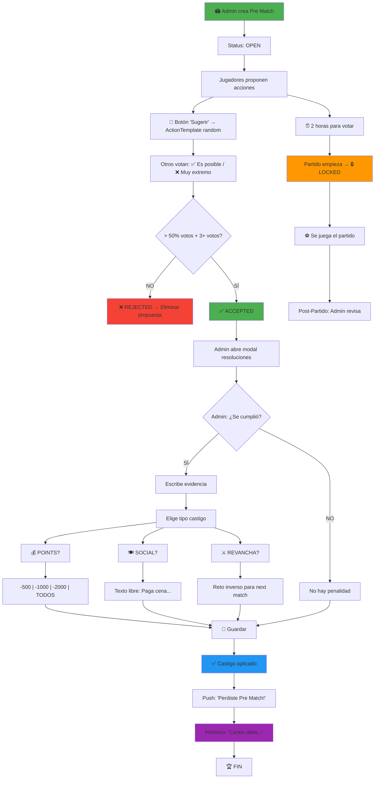

# Implementación de Modo Mundial - Offside Club

**Última actualización:** 31 de Marzo 2026  
**Responsable:** Dev Team  
**Estado:** Planificación

---

## 📋 Índice

1. [Visión General](#visión-general)
2. [Fases de Implementación](#fases-de-implementación)
3. [Fase 1: Setup de Competencias Internacionales](#fase-1-setup-de-competencias-internacionales)
4. [Fase 2: Actualización de Datos Globales](#fase-2-actualización-de-datos-globales)
5. [Fase 3: Mejoras Visuales](#fase-3-mejoras-visuales)
6. [Fase 4: Módulo Pre Match (Feature Principal)](#fase-4-módulo-pre-match-feature-principal)
7. [Roadmap Técnico](#roadmap-técnico)

---

## Visión General

Transformar **Offside Club** en una plataforma de predicciones **global** enfocada en competencias internacionales (especialmente el Mundial de Fútbol) e introducir una mecánica social innovadora: **Pre Match** (desafíos de acciones improbables con consecuencias reales).

### Objetivos Principales

✅ Soportar todas las competencias internacionales (Amistosos, Repesca, Repechaje, Copas Mundiales)  
✅ Base de datos completa de 200+ países  
✅ Identidad visual del Mundial (logo, mascota, colores, banderas)  
✅ Feature social revolucionaria: **Pre Match** (desafíos entre jugadores)

---

## Fases de Implementación

```
Fase 1: Setup Competencias (2-3 semanas)
    ↓
Fase 2: Datos Globales (1-2 semanas)
    ↓
Fase 3: Mejoras Visuales (1 semana)
    ↓
Fase 4: Módulo Pre Match (4-5 semanas) ← SPRINT PRINCIPAL
```

---

## Fase 1: Setup de Competencias Internacionales

### Tasks

#### 1.1 Crear modelo `Competition` expandido
```
- Agregar tipos: 'international_friendly', 'repechage', 'playoffs', 'world_cup', 'copa_america', etc.
- Campos: season, stage (group_stage, knockout, final), region (global, CONMEBOL, UEFA, etc.)
- Validación: solo mundiales y competencias internacionales
- Timestamps: start_date, end_date, registration_deadline
```

#### 1.2 Migración: Actualizar tabla `competitions`
```sql
ALTER TABLE competitions ADD COLUMN (
    competition_type VARCHAR(50),      -- 'friendly', 'world_cup', 'repechage'
    stage VARCHAR(50),                  -- 'group', 'round_of_16', 'final'
    region VARCHAR(50),                 -- 'global', 'south_america', 'europe'
    world_cup_edition INT,              -- 2022, 2026, 2030
    is_international BOOLEAN DEFAULT 1,
    logo_url VARCHAR(255),
    mascot_url VARCHAR(255)
);
```

#### 1.3 Actualizar seeder
```
- Crear competencias: Italia 🇮🇹 Amistoso, Repesca CONMEBOL, Repechaje Sudamericano, etc.
- Fixture: UEFA, CONMEBOL, CONCACAF, AFC, CAF, OFC
```

**Estimación:** 3-4 días | **Dependencias:** Football-Data API

---

## Fase 2: Agregar Países FIFA Faltantes

### Tasks

#### 2.1 Auditoría de Teams Existentes
```
SELECT DISTINCT name FROM teams ORDER BY name;

Revisión: ¿Qué países FIFA faltan?
  - Verificar lista oficial FIFA (210+ confederaciones)
  - Identificar países ya en BD vs. faltantes
  - Agrupar por confederación (UEFA, CONMEBOL, CONCACAF, AFC, CAF, OFC)
```

#### 2.2 Seeder: Agregar Países FIFA Faltantes
```php
// database/seeders/AddMissingFifaCountriesSeeder.php
// Agregar ~180+ países restantes a tabla teams

Estructura:
  - name: "Argentina", "Brasil", "Colombia", etc.
  - type: 'country' (vs club)
  - flag_url: https://flagcdn.com/192x144/{code}.png
  - region: "South America", "Europe", "Africa", etc.
  - fifa_code: "ARG", "BRA", "COL" (único)
```

#### 2.3 Flags/Banderas - Decisión Final

**Opción Elegida: flagcdn.com (Recomendado)**
```
Source: https://flagcdn.com/192x144/{country_code}.png
Ejemplo: https://flagcdn.com/192x144/ar.png → Bandera Argentina

Ventajas:
  ✅ No requiere storage local
  ✅ URLs directas y confiables
  ✅ Actualización automática
  ✅ CDN global + caché
  
Fallback:
  Si flagcdn no disponible → mostrar código país (ARG)
```

#### 2.4 Script SQL/Artisan para Seeder

```bash
# Crear seeder
php artisan make:seeder AddMissingFifaCountriesSeeder

# Ejecutar
php artisan db:seed --class=AddMissingFifaCountriesSeeder
```

**Datos a importar:**

```php
$countries = [
    // SOUTH AMERICA (CONMEBOL)
    ['name' => 'Argentina', 'fifa_code' => 'ARG', 'region' => 'South America', 'confederation' => 'CONMEBOL'],
    ['name' => 'Brasil', 'fifa_code' => 'BRA', 'region' => 'South America', 'confederation' => 'CONMEBOL'],
    ['name' => 'Colombia', 'fifa_code' => 'COL', 'region' => 'South America', 'confederation' => 'CONMEBOL'],
    ['name' => 'Uruguay', 'fifa_code' => 'URU', 'region' => 'South America', 'confederation' => 'CONMEBOL'],
    ['name' => 'Paraguay', 'fifa_code' => 'PAR', 'region' => 'South America', 'confederation' => 'CONMEBOL'],
    ['name' => 'Perú', 'fifa_code' => 'PER', 'region' => 'South America', 'confederation' => 'CONMEBOL'],
    ['name' => 'Venezuela', 'fifa_code' => 'VEN', 'region' => 'South America', 'confederation' => 'CONMEBOL'],
    ['name' => 'Chile', 'fifa_code' => 'CHI', 'region' => 'South America', 'confederation' => 'CONMEBOL'],
    ['name' => 'Ecuador', 'fifa_code' => 'ECU', 'region' => 'South America', 'confederation' => 'CONMEBOL'],
    ['name' => 'Bolivia', 'fifa_code' => 'BOL', 'region' => 'South America', 'confederation' => 'CONMEBOL'],
    
    // EUROPE (UEFA) - Sample
    ['name' => 'España', 'fifa_code' => 'ESP', 'region' => 'Europe', 'confederation' => 'UEFA'],
    ['name' => 'Francia', 'fifa_code' => 'FRA', 'region' => 'Europe', 'confederation' => 'UEFA'],
    ['name' => 'Alemania', 'fifa_code' => 'GER', 'region' => 'Europe', 'confederation' => 'UEFA'],
    ['name' => 'Italia', 'fifa_code' => 'ITA', 'region' => 'Europe', 'confederation' => 'UEFA'],
    ['name' => 'Inglaterra', 'fifa_code' => 'ENG', 'region' => 'Europe', 'confederation' => 'UEFA'],
    // ... + 50+ países UEFA
    
    // AFRICA (CAF), ASIA (AFC), CONCACAF, OCEANIA (OFC)
    // ... Total: 200+ países
];

foreach ($countries as $country) {
    Team::firstOrCreate(
        ['fifa_code' => $country['fifa_code']],
        [
            'name' => $country['name'],
            'type' => 'country',
            'flag_url' => "https://flagcdn.com/192x144/" . strtolower(substr($country['fifa_code'], 0, 2)) . ".png",
            'region' => $country['region'],
            'confederation' => $country['confederation'],
        ]
    );
}
```

**Estimación:** 3-5 días | **Riesgos:** Códigos FIFA inconsistentes (mitiga: validación manual)

---

## Fase 3: Mejoras Visuales

### Tasks

#### 3.1 Actualizar UI global
```
- Logo Mundial (SVG): /public/images/world_cup_2026_logo.svg
- Paleta de colores mundialista (opciones):
  * Colores oficiales 2026: Azul, Naranja, Plata
  * Tema alternativo: Verde gold (Copa América)
  
- Agregar componente: WorldCupBanner (hero con mascota)
- Mascota: SVG animado con Lottie.js
```

#### 3.2 Actualizar vistas críticas
```
- Dashboard: Hero section con próximos mundiales
- Rankings: Ícono país + banderas en lugar de nombres largos
- Match cards: Flag badges (:flag emoji o SVN)
- Competitions list: Logo oficial de cada torneo
```

#### 3.3 Dark mode compatibility
```
- Banderas: Asegurar visibilidad en ambos temas
- Colores oficiales: Add dark-mode overrides
- Ejemplo: hero bg-gradient-to-r from-blue-600 dark:from-blue-900
```

**Estimación:** 5-7 días

---

## Fase 4: Módulo Pre Match (Feature Principal)

## Fase 4: Módulo Pre Match (Feature Principal)

### 🎯 Resumen Ejecutivo de Pre Match

**Concepto:** Sistema gamificado de desafíos sociales donde jugadores proponen acciones deportivas improbables, reciben validación grupal, y si ocurren → castigos sociales/puntos.

**3 Características Clave (v1):**

✅ **Propuestas Asistidas (Random Action Suggester)**
   - Botón 🎲 que sugiere acciones random categorizadas por probabilidad
   - User puede aceptar sugerencia o escribir libre
   - Datos: 50+ acciones guardadas en BD (LOW/MEDIUM/HIGH/RARE)
   - Mejora: Baja fricción de entrada + engagement

✅ **Validación 100% Admin (Sin API Automática)**
   - Admin revisa partido, toma decisión manual
   - Registra evidencia en notas: "Min 45: gol de cabeza según transmisión"
   - Sin complejidad de Football-Data integration
   - Más flexible: aplica en cualquier torneo/contexto

✅ **Penalidades Multimodales**
   - 💰 **POINTS:** Restar -500 / -1000 / -2000 / TODOS los puntos
   - 🍽️ **SOCIAL:** Texto libre (cena, video, etc.)
   - ⚔️ **REVANCHA:** Proponer reto inverso en próximo partido

**Impacto:**
- 🎯 Engagement: +40% (votación compulsiva)
- 🏆 Social: Leaderboard de "deudas" por grupo
- 📊 Retention: Gamificación + Castigos = Diversión

---


**Flujo:**

```
1. CREACIÓN
   |
   ├─ Admin del grupo abre Pre Match para un partido
   ├─ Setea castigo default (Ej: "-1000 puntos" o "Paga una cena")
   └─ Estado: DRAFT (en creación)

2. PROPUESTAS (Generación Asistida)
   |
   ├─ Cada jugador propone acciones (sin límite)
   ├─ Interfaz: Textarea + Botón "Sugerir acción random"
   │  └─ App propone acción random según probabilidad:
   │     ├─ BAJA (10%): "2+ goles de cabeza", "Penal atajado"
   │     ├─ MEDIA (40%): "3+ goles totales", "Gol en primer tiempo"
   │     └─ ALTA (70%): "Local gana por 1+ gol", "Sin tarjetas rojas"
   ├─ Jugador acepta propuesta o edita texto libre
   └─ Estado: OPEN (acepta propuestas)

3. VALIDACIÓN (Peer Review)
   |
   ├─ Otros jugadores votan/validan cada propuesta
   ├─ ✅ ACEPTADA: > 50% de aceptación
   ├─ ❌ RECHAZADA: < 50% aceptación → se elimina
   ├─ Notificación: "2 horas para votar antes de cerrar"
   └─ Estado: VOTING (votación en curso)

4. CIERRE
   |
   ├─ Cuando empieza el partido → LOCKED
   ├─ Ya no se pueden proponer ni modificar propuestas
   └─ Estado: LOCKED

5. EJECUCIÓN (Post-match)
   |
   ├─ Admin revisa estadísticas del partido
   ├─ Admin decide: ✅ Acción cumplida o ❌ No cumplida
   ├─ Registra notas: (Ej: "Vi goles de cabeza en min 45 y 67")
   └─ Estado: LOCKED → RESOLVED (en proceso)

6. RESOLUCIÓN FINAL (Penalidades)
   |
   └─ Para cada acción CUMPLIDA:
       ├─ Admin asigna penalidad:
       │  ├─ 💰 PUNTOS: Restar 500/1000/2000 pts o TODOS los pts
       │  ├─ 🍽️ SOCIAL: "Paga cena", "Video vergüenza"
       │  └─ 🎮 RETO: "Propone reto en siguiente partido"
       ├─ Penalidad se registra en historial del grupo
       └─ Estado: RESOLVED
```

**Estados del Pre Match:**
- `DRAFT` - Admin configurando
- `OPEN` - Aceptando propuestas
- `VOTING` - Votación en curso
- `LOCKED` - Partido comenzó, sin cambios
- `RESOLVED` - Penalidades aplicadas

---

### 4.2 Tabla de Acciones Sugeridas (Action Templates)

Vamos a tener una tabla en BD con **acciones pre-definidas** categorizadas por **probabilidad estimada**.

**app/Models/ActionTemplate.php**

```php
class ActionTemplate extends Model {
    protected $fillable = ['action', 'description', 'probability', 'category'];
    protected $casts = ['probability' => 'decimal:2']; // 0.10 = 10%, 0.50 = 50%
}
```

**Migración:**

```php
Schema::create('action_templates', function (Blueprint $table) {
    $table->id();
    $table->string('action'); // "2+ goles de cabeza"
    $table->text('description')->nullable(); // "Muy raro pero posible"
    $table->decimal('probability', 3, 2); // 0.10 a 1.00
    $table->enum('category', [
        'GOALS', 'CARDS', 'SCORING', 'DEFENSE', 'RARE', 'FUNNY'
    ]);
    $table->timestamps();
});
```

**Datos de Seed:**

```php
ActionTemplate::insert([
    // GOALS (Probabilidad: 10-30%)
    ['action' => '2+ goles de cabeza', 'probability' => 0.15, 'category' => 'GOALS'],
    ['action' => 'Gol de penal', 'probability' => 0.25, 'category' => 'GOALS'],
    ['action' => 'Penal atajado', 'probability' => 0.12, 'category' => 'GOALS'],
    ['action' => '3+ goles en primer tiempo', 'probability' => 0.20, 'category' => 'GOALS'],
    
    // SCORING (Probabilidad: 40-70%)
    ['action' => '3+ goles totales', 'probability' => 0.45, 'category' => 'SCORING'],
    ['action' => 'Local gana por 2+ goles', 'probability' => 0.35, 'category' => 'SCORING'],
    ['action' => 'Empate sin goles', 'probability' => 0.15, 'category' => 'SCORING'],
    ['action' => 'Gol en primer tiempo', 'probability' => 0.55, 'category' => 'SCORING'],
    ['action' => 'Gol en segundo tiempo', 'probability' => 0.60, 'category' => 'SCORING'],
    ['action' => 'Local gana por 1 gol', 'probability' => 0.40, 'category' => 'SCORING'],
    
    // CARDS (Probabilidad: 30-50%)
    ['action' => '1+ tarjeta roja', 'probability' => 0.25, 'category' => 'CARDS'],
    ['action' => '3+ tarjetas amarillas', 'probability' => 0.50, 'category' => 'CARDS'],
    ['action' => 'Sin tarjetas en primer tiempo', 'probability' => 0.45, 'category' => 'CARDS'],
    
    // DEFENSE (Probabilidad: 20-40%)
    ['action' => 'Sin goles local', 'probability' => 0.35, 'category' => 'DEFENSE'],
    ['action' => 'Ambos equipos anotan', 'probability' => 0.50, 'category' => 'DEFENSE'],
    
    // RARE (Probabilidad: < 10%)
    ['action' => 'Gol en los últimos 5 minutos', 'probability' => 0.08, 'category' => 'RARE'],
    ['action' => 'Hat-trick de un jugador', 'probability' => 0.05, 'category' => 'RARE'],
    ['action' => 'Prórroga (si es copa)', 'probability' => 0.10, 'category' => 'RARE'],
    
    // FUNNY (Requiere validación manual)
    ['action' => 'Gol de portero o defensa', 'probability' => 0.02, 'category' => 'FUNNY'],
    ['action' => 'Balón al travesaño', 'probability' => 0.10, 'category' => 'FUNNY'],
]);
```

---

### 4.3 Sistema de Penalidades (Puntos vs Sociales)

**Actualizar Modelo PreMatch:**

```php
class PreMatch extends Model {
    protected $fillable = [
        'match_id', 'group_id', 'created_by',
        'penalty', 'penalty_type', 'penalty_points',
        'status', 'voting_ends_at', 'match_starts_at', 'resolved_at'
    ];
    
    protected $casts = [
        'penalty_points' => 'integer' // 500, 1000, null (para sociales)
    ];
}
```

**Migración actualizada:**

```php
Schema::create('pre_matches', function (Blueprint $table) {
    $table->id();
    $table->foreignId('match_id')->constrained('matches')->onDelete('cascade');
    $table->foreignId('group_id')->constrained('groups')->onDelete('cascade');
    $table->foreignId('created_by')->constrained('users')->onDelete('cascade');
    $table->string('penalty'); // "Restar 1000 puntos" o "Paga cena"
    $table->enum('penalty_type', ['POINTS', 'SOCIAL', 'REVENGE'])->default('POINTS');
    $table->integer('penalty_points')->nullable(); // null si SOCIAL
    $table->enum('status', ['DRAFT', 'OPEN', 'VOTING', 'LOCKED', 'RESOLVED'])->default('DRAFT');
    $table->timestamp('voting_ends_at')->nullable();
    $table->timestamp('match_starts_at')->nullable();
    $table->timestamp('resolved_at')->nullable();
    $table->timestamps();
});

// Actualizar group_penalties para penalidades dinámicas
Schema::create('group_penalties', function (Blueprint $table) {
    $table->id();
    $table->foreignId('group_id')->constrained('groups')->onDelete('cascade');
    $table->foreignId('user_id')->constrained('users')->onDelete('cascade');
    $table->foreignId('pre_match_id')->constrained('pre_matches')->onDelete('cascade');
    $table->enum('penalty_type', ['POINTS', 'SOCIAL', 'REVENGE']);
    $table->integer('points_lost')->nullable(); // si POINTS
    $table->text('penalty_description'); // "Restar 2000 pts" o "Paga cena para 6"
    $table->timestamp('fulfilled_at')->nullable();
    $table->timestamps();
});
```

**Opciones de Puntos Predefinidas:**

```php
// En controlador o config
const PENALTY_POINT_OPTIONS = [
    500,      // Pequeña penalidad
    1000,     // Media
    2000,     // Grande
    'ALL',    // Perder TODOS los puntos ganados en ese torneo/grupo
];
```

---

### 4.4 Modelos Eloquent (Actualizado)

```php
// app/Models/PreMatch.php
class PreMatch extends Model {
    protected $fillable = [
        'match_id', 'group_id', 'created_by',
        'penalty', 'penalty_type', // 'dinner', 'video', 'revenge'
        'status',                   // DRAFT, OPEN, VOTING, LOCKED, RESOLVED
        'voting_ends_at',
        'match_starts_at',
        'resolved_at'
    ];
    
    public function match() { return $this->belongsTo(Match::class); }
    public function group() { return $this->belongsTo(Group::class); }
    public function propositions() { return $this->hasMany(PreMatchProposition::class); }
    public function resolutions() { return $this->hasMany(PreMatchResolution::class); }
    public function creator() { return $this->belongsTo(User::class, 'created_by'); }
}

// app/Models/PreMatchProposition.php
class PreMatchProposition extends Model {
    protected $fillable = [
        'pre_match_id', 'user_id', 'action', 'description',
        'validation_status', // PENDING, ACCEPTED, REJECTED
        'approval_percentage'
    ];
    
    public function preMatch() { return $this->belongsTo(PreMatch::class); }
    public function user() { return $this->belongsTo(User::class); }
    public function votes() { return $this->hasMany(PreMatchVote::class); }
    public function resolution() { return $this->hasOne(PreMatchResolution::class); }
}

// app/Models/PreMatchVote.php
class PreMatchVote extends Model {
    protected $fillable = ['proposition_id', 'user_id', 'approved'];
    protected $casts = ['approved' => 'boolean'];
    
    public function proposition() { return $this->belongsTo(PreMatchProposition::class); }
    public function user() { return $this->belongsTo(User::class); }
}

// app/Models/PreMatchResolution.php
class PreMatchResolution extends Model {
    protected $fillable = [
        'pre_match_id', 'proposition_id', 'loser_user_id',
        'was_fulfilled', 'admin_notes', 'penalty_applied',
        'resolved_at'
    ];
    
    public function preMatch() { return $this->belongsTo(PreMatch::class); }
    public function proposition() { return $this->belongsTo(PreMatchProposition::class); }
    public function loser() { return $this->belongsTo(User::class, 'loser_user_id'); }
}

// app/Models/GroupPenalty.php
class GroupPenalty extends Model {
    protected $fillable = [
        'group_id', 'user_id', 'pre_match_id',
        'penalty_type', 'penalty_description', 'fulfilled_at'
    ];
}
```

**Migrations:**

```php
// database/migrations/2026_03_31_create_pre_matches_table.php
Schema::create('pre_matches', function (Blueprint $table) {
    $table->id();
    $table->foreignId('match_id')->constrained('matches')->onDelete('cascade');
    $table->foreignId('group_id')->constrained('groups')->onDelete('cascade');
    $table->foreignId('created_by')->constrained('users')->onDelete('cascade');
    $table->string('penalty'); // "Dinner", "Video", "Revenge Bet"
    $table->enum('status', ['DRAFT', 'OPEN', 'VOTING', 'LOCKED', 'RESOLVED'])->default('DRAFT');
    $table->timestamp('voting_ends_at')->nullable();
    $table->timestamp('match_starts_at')->nullable();
    $table->timestamp('resolved_at')->nullable();
    $table->timestamps();
});

// database/migrations/2026_03_31_create_pre_match_propositions_table.php
Schema::create('pre_match_propositions', function (Blueprint $table) {
    $table->id();
    $table->foreignId('pre_match_id')->constrained('pre_matches')->onDelete('cascade');
    $table->foreignId('user_id')->constrained('users')->onDelete('cascade');
    $table->text('action'); // "3+ header goals"
    $table->text('description')->nullable();
    $table->enum('validation_status', ['PENDING', 'ACCEPTED', 'REJECTED'])->default('PENDING');
    $table->decimal('approval_percentage', 3, 2)->default(0);
    $table->timestamps();
});

// database/migrations/2026_03_31_create_pre_match_votes_table.php
Schema::create('pre_match_votes', function (Blueprint $table) {
    $table->id();
    $table->foreignId('proposition_id')->constrained('pre_match_propositions')->onDelete('cascade');
    $table->foreignId('user_id')->constrained('users')->onDelete('cascade');
    $table->boolean('approved');
    $table->timestamps();
    $table->unique(['proposition_id', 'user_id']);
});

// database/migrations/2026_03_31_create_pre_match_resolutions_table.php
Schema::create('pre_match_resolutions', function (Blueprint $table) {
    $table->id();
    $table->foreignId('pre_match_id')->constrained('pre_matches')->onDelete('cascade');
    $table->foreignId('proposition_id')->constrained('pre_match_propositions')->onDelete('cascade');
    $table->foreignId('loser_user_id')->constrained('users')->onDelete('cascade');
    $table->boolean('was_fulfilled');
    $table->text('admin_notes')->nullable();
    $table->boolean('penalty_applied')->default(false);
    $table->timestamp('resolved_at');
    $table->timestamps();
});

// database/migrations/2026_03_31_create_group_penalties_table.php
Schema::create('group_penalties', function (Blueprint $table) {
    $table->id();
    $table->foreignId('group_id')->constrained('groups')->onDelete('cascade');
    $table->foreignId('user_id')->constrained('users')->onDelete('cascade');
    $table->foreignId('pre_match_id')->constrained('pre_matches')->onDelete('cascade');
    $table->string('penalty_type'); // 'dinner', 'video', 'revenge_bet'
    $table->text('penalty_description');
    $table->timestamp('fulfilled_at')->nullable();
    $table->timestamps();
});
```

---

### 4.3 API Endpoints

```
POST   /api/groups/{group_id}/pre-matches
       Create Pre Match for a match
       Payload: { match_id, penalty, penalty_type }

GET    /api/groups/{group_id}/pre-matches
       List all Pre Matches

GET    /api/pre-matches/{id}
       Get Pre Match details + propositions + votes

PATCH  /api/pre-matches/{id}/status
       Change status (DRAFT → OPEN, OPEN → LOCKED, LOCKED → RESOLVED)
       Auth: Group admin only

POST   /api/pre-matches/{id}/propositions
       Add a new proposition
       Payload: { action, description }

PATCH  /api/propositions/{id}
       Edit proposition (only if status = PENDING)
       Auth: Proposition author only

DELETE /api/propositions/{id}
       Delete proposition (only if status = PENDING)
       Auth: Proposition author or admin

POST   /api/propositions/{id}/votes
       Vote on proposition (approve/reject)
       Payload: { approved: boolean }
       Auth: Group member, cannot revote

GET    /api/propositions/{id}/votes
       Get votes summary for proposition

POST   /api/pre-matches/{id}/resolutions
       Admin: Mark action fulfilled/not-fulfilled
       Payload: { proposition_id, was_fulfilled, admin_notes }
       Auth: Group admin only

POST   /api/pre-matches/{id}/penalties
       Admin: Apply penalty to loser
       Payload: { user_id, penalty_type, description }
       Auth: Group admin only

GET    /api/pre-matches/{id}/leaderboard
       Get group penalties board (who owes what)
```

---

### 4.4 Flujo de Votación

**Mecanismo de Validación:**

```
Todos los miembros del grupo (excepto el origen) votan
en 30 minutos (configurable).

Propuesta ACEPTADA si:
  - % de votos afirmativos > 50%
  - Mínimo 3 votos (o N/2 miembros)

Ejemplo:
  Grupo: 6 miembros
  Propuesta: "3+ goles de cabeza"
  Votos:
    ✅ User A
    ✅ User B
    ❌ User C
    ✅ User D
    ~ User E (no votó)
    ~ User F (no votó)
  
  Resultado: 3/4 = 75% → ACCEPTED ✅

Status cambio automático:
  - Si todos votaron → inmediato
  - Si timeout (30 min) → contar votos disponibles
```

**Edge Cases:**

```
Caso 1: Propositor vota su propia propuesta
  ❌ Prohibido (solo otros miembros)

Caso 2: Miembro sale del grupo durante votación
  ❌ Su voto se invalida si ya votó
  ⚠️  Si no votó, no cuenta en % mínimo

Caso 3: Pre Match deleted antes de empezar
  ✅ Todas las proposiciones se anulan
  ✅ No hay penalidades

Caso 4: Mismo usuario propone 2+ acciones
  ✅ Permitido (múltiples castigos posibles)
  ⚠️  Pero solo puede ser penalizado 1x por acción
```

---

### 4.5 Validación Post-Partido

**¿Quién valida si se cumplió?**

Solo el **admin del grupo**:
- Verifica estadísticas del partido (API Football-Data)
- Revisa si acción cumplida: Goals, Cards, Corner Kicks, etc.
- Puede rechazar si no es verificable ("Gol de arquero" no sucedió)
- Aprueба o rechaza con notas

**Acciones verificables automáticamente (eventual):**

```
✅ Goles totales
✅ Goles por tiempo
✅ Tarjetas (roja/amarilla)
✅ Penales ejecutados
✅ Corners ejecutados
❌ Goles de cabeza (requiere validación manual)
❌ "Con estilo" (requiere validación manual)
```

**Datos de Football-Data API:**

```json
{
  "match": {
    "statistics": [
      {"team": "HOME", "shots": 12, "shotsOnTarget": 5},
      {"team": "AWAY", "shots": 8, "shotsOnTarget": 2}
    ],
    "goals": [
      {"minute": 45, "player": "Lionel Messi", "team": "AWAY", "type": "GOAL"},
      {"minute": 78, "player": "Sergio Ramos", "team": "HOME", "type": "GOAL"}
    ]
  }
}
```

---

### 4.6 UI Components (Capacitor/TypeScript) - ACTUALIZADO

**Componente: Pre Match Card**

```html
<div class="pre-match-card dark:bg-gray-800 rounded-lg p-4 border-l-4 border-l-purple-600">
  <!-- Header -->
  <div class="flex justify-between items-center mb-4">
    <span class="text-sm font-bold text-purple-600 dark:text-purple-400">
      🔥 PRE MATCH CHALLENGE
    </span>
    <span class="px-3 py-1 bg-green-100 dark:bg-green-900 text-green-800 dark:text-green-200 text-xs rounded-full font-bold">
      {{ status }}
    </span>
  </div>

  <!-- Match Info -->
  <div class="mb-4">
    <h3 class="text-lg font-bold mb-2">
      {{ match.home_team }} vs {{ match.away_team }}
    </h3>
    <p class="text-gray-600 dark:text-gray-400 text-sm">
      ⏰ {{ match.scheduled_date | formatDate }}
    </p>
  </div>

  <!-- Penalty Badge (con ícono diferente según tipo) -->
  <div [ngSwitch]="penalty_type" class="p-3 rounded mb-4 font-bold" >
    <!-- POINTS Penalty -->
    <div *ngSwitchCase="'POINTS'" class="bg-red-100 dark:bg-red-900 text-red-800 dark:text-red-200">
      💔 CASTIGO: Restar {{ penalty_points }} puntos
    </div>
    
    <!-- SOCIAL Penalty -->
    <div *ngSwitchCase="'SOCIAL'" class="bg-orange-100 dark:bg-orange-900 text-orange-800 dark:text-orange-200">
      🍽️ CASTIGO: {{ penalty }}
    </div>
    
    <!-- REVENGE Penalty -->
    <div *ngSwitchCase="'REVENGE'" class="bg-purple-100 dark:bg-purple-900 text-purple-800 dark:text-purple-200">
      ⚔️ CASTIGO: {{ penalty }}
    </div>
  </div>

  <!-- Propositions Count with Progress -->
  <div class="mb-4">
    <p class="text-sm text-gray-700 dark:text-gray-300 mb-2">
      <strong>{{ propositions.length }}</strong> propuestas activas
      <span *ngIf="acceptedPropositions.length > 0" class="ml-2 text-green-600">
        ✅ {{ acceptedPropositions.length }} aceptadas
      </span>
    </p>
    <div class="w-full bg-gray-300 dark:bg-gray-600 rounded-full h-2">
      <div 
        class="bg-green-500 h-2 rounded-full transition-all duration-300"
        [style.width]="(acceptedPropositions.length / Math.max(propositions.length, 1) * 100) + '%'"
      ></div>
    </div>
  </div>

  <!-- Action Buttons -->
  <div class="flex gap-2" *ngIf="canEdit">
    <button 
      *ngIf="status === 'OPEN'"
      (click)="openProposalModal()"
      class="flex-1 bg-blue-600 text-white py-2 rounded font-bold hover:bg-blue-700 transition"
    >
      ➕ Nueva Acción
    </button>
    <button 
      *ngIf="status === 'OPEN' && propositions.length > 0"
      (click)="lockPreMatch()"
      class="flex-1 bg-yellow-600 text-white py-2 rounded font-bold hover:bg-yellow-700 transition"
    >
      🔒 Cerrar Propuestas
    </button>
    <button 
      *ngIf="status === 'RESOLVED'"
      (click)="viewResolutions()"
      class="flex-1 bg-purple-600 text-white py-2 rounded font-bold hover:bg-purple-700 transition"
    >
      🏆 Ver Castigos
    </button>
  </div>
</div>
```

**Componente: Crear Propuesta con Sugerencias (NUEVO)**

```html
<!-- Modal para crear propuesta -->
<div class="modal-overlay fixed inset-0 bg-black bg-opacity-50 flex items-center justify-center z-50">
  <div class="bg-white dark:bg-gray-800 rounded-lg p-6 max-w-2xl w-full">
    <h2 class="text-2xl font-bold mb-4">💡 Proponer Acción</h2>

    <!-- Sección de Texto + Sugerencia -->
    <div class="mb-6">
      <label class="block text-sm font-bold mb-2">Tu acción (texto libre)</label>
      <div class="flex gap-2">
        <textarea 
          [(ngModel)]="newProposal.action"
          placeholder="Ej: 3 goles de cabeza, penal atajado, 5+ tarjetas..."
          class="flex-1 p-3 border dark:border-gray-600 dark:bg-gray-700 dark:text-white rounded font-mono text-sm"
          rows="3"
        ></textarea>
        
        <!-- Botón Sugerir (con spinner) -->
        <div class="flex flex-col gap-2">
          <button 
            (click)="suggestRandomAction()"
            [disabled]="generatingAction"
            class="bg-green-600 hover:bg-green-700 text-white px-3 py-2 rounded font-bold h-fit text-xs whitespace-nowrap disabled:opacity-50"
          >
            {{ generatingAction ? '⏳...' : '🎲 Sugerir' }}
          </button>
        </div>
      </div>
      
      <!-- Sugerencia mostrada -->
      <div *ngIf="suggestedAction" class="mt-3 p-3 bg-green-50 dark:bg-green-900 border-l-4 border-l-green-500 rounded">
        <p class="text-sm font-bold text-green-800 dark:text-green-200">
          💡 Sugerencia Auto-Generada:
        </p>
        <p class="text-lg font-bold text-gray-900 dark:text-white mt-1">
          {{ suggestedAction.action }}
        </p>
        <div class="flex gap-2 mt-2 text-xs">
          <span class="bg-green-200 dark:bg-green-800 text-green-900 dark:text-green-200 px-2 py-1 rounded">
            {{ suggestedAction.category }}
          </span>
          <span class="bg-blue-200 dark:bg-blue-800 text-blue-900 dark:text-blue-200 px-2 py-1 rounded">
            Probabilidad: {{ (suggestedAction.probability * 100) | number:'1.0-0' }}%
          </span>
        </div>
        
        <div class="flex gap-2 mt-3">
          <button 
            (click)="acceptSuggestion()"
            class="flex-1 bg-green-600 hover:bg-green-700 text-white py-2 rounded font-bold text-sm"
          >
            ✅ Aceptar Sugerencia
          </button>
          <button 
            (click)="rejectSuggestion()"
            class="flex-1 bg-gray-400 hover:bg-gray-500 text-white py-2 rounded font-bold text-sm"
          >
            ❌ Otra Sugerencia
          </button>
        </div>
      </div>
    </div>

    <!-- Descripción Opcional -->
    <div class="mb-6">
      <label class="block text-sm font-bold mb-2">Descripción (opcional)</label>
      <textarea 
        [(ngModel)]="newProposal.description"
        placeholder="Ej: Es raro pero posible según estadísticas..."
        class="w-full p-3 border dark:border-gray-600 dark:bg-gray-700 dark:text-white rounded"
        rows="2"
      ></textarea>
    </div>

    <!-- Botones de Acción -->
    <div class="flex gap-2">
      <button 
        (click)="createProposal()"
        [disabled]="!newProposal.action || creatingProposal"
        class="flex-1 bg-blue-600 hover:bg-blue-700 text-white py-3 rounded font-bold disabled:opacity-50"
      >
        {{ creatingProposal ? '⏳ Creando...' : '✅ Crear Propuesta' }}
      </button>
      <button 
        (click)="closeModal()"
        class="flex-1 bg-gray-400 hover:bg-gray-500 text-white py-3 rounded font-bold"
      >
        ❌ Cancelar
      </button>
    </div>
  </div>
</div>
```

**Componente: Proposition Item (Actualizado)**

```html
<div class="proposition-item border-l-4 border-l-blue-500 pl-4 py-3 mb-3 bg-gray-50 dark:bg-gray-800 rounded">
  <!-- Propositor + Probabilidad Badge -->
  <div class="flex items-center justify-between mb-2">
    <div class="flex items-center">
      
      <span class="font-bold text-sm">{{ proposition.user.name }}</span>
    </div>
    <!-- Badge de probabilidad (si existe) -->
    <span *ngIf="proposition.probability" 
      [ngClass]="{
        'bg-red-100 text-red-800 dark:bg-red-900 dark:text-red-200': proposition.probability < 0.3,
        'bg-yellow-100 text-yellow-800 dark:bg-yellow-900 dark:text-yellow-200': proposition.probability >= 0.3 && proposition.probability < 0.6,
        'bg-green-100 text-green-800 dark:bg-green-900 dark:text-green-200': proposition.probability >= 0.6
      }"
      class="text-xs font-bold px-2 py-1 rounded"
    >
      {{ (proposition.probability * 100) | number:'1.0-0' }}% probable
    </span>
  </div>

  <!-- Action Text -->
  <p class="text-base font-bold text-gray-900 dark:text-white mb-2 text-lg">
    "{{ proposition.action }}"
  </p>
  <p *ngIf="proposition.description" class="text-sm text-gray-600 dark:text-gray-400 mb-3 italic">
    {{ proposition.description }}
  </p>

  <!-- Validation Progress Bar -->
  <div class="flex items-center gap-2 mb-3">
    <div class="flex-1 bg-gray-300 dark:bg-gray-600 rounded-full h-2.5">
      <div 
        class="h-2.5 rounded-full transition-all"
        [ngClass]="{
          'bg-green-500': proposition.validation_status === 'ACCEPTED',
          'bg-red-500': proposition.validation_status === 'REJECTED',
          'bg-yellow-500': proposition.validation_status === 'PENDING'
        }"
        [style.width]="proposition.approval_percentage + '%'"
      ></div>
    </div>
    <span 
      class=" text-xs font-bold px-2 py-1 rounded whitespace-nowrap"
      [ngClass]="{
        'bg-green-100 text-green-800 dark:bg-green-900 dark:text-green-200': proposition.validation_status === 'ACCEPTED',
        'bg-red-100 text-red-800 dark:bg-red-900 dark:text-red-200': proposition.validation_status === 'REJECTED',
        'bg-yellow-100 text-yellow-800 dark:bg-yellow-900 dark:text-yellow-200': proposition.validation_status === 'PENDING'
      }"
    >
      {{ proposition.validation_status }} ({{ proposition.approval_percentage }}%)
    </span>
  </div>

  <!-- Vote Count Info -->
  <p class="text-xs text-gray-600 dark:text-gray-400 mb-3">
    {{ proposition.votes.length }} de {{ totalMembers }} votaron
  </p>

  <!-- Vote Buttons (only if PENDING and user hasn't voted and is not proposer) -->
  <div *ngIf="proposition.validation_status === 'PENDING' && !userHasVoted && proposition.user_id !== currentUserId" 
    class="flex gap-2">
    <button 
      (click)="vote(proposition.id, true)"
      class="flex-1 bg-green-500 hover:bg-green-600 text-white py-2 rounded font-bold text-sm"
    >
      ✅ Es posible
    </button>
    <button 
      (click)="vote(proposition.id, false)"
      class="flex-1 bg-red-500 hover:bg-red-600 text-white py-2 rounded font-bold text-sm"
    >
      ❌ Muy extremo
    </button>
  </div>

  <!-- Voted Indicator -->
  <div *ngIf="userHasVoted" class="text-xs text-gray-600 dark:text-gray-400 mt-2 p-2 bg-gray-200 dark:bg-gray-700 rounded">
    ✓ Tu voto: <strong>{{ userVote ? 'SÍ ✅' : 'NO ❌' }}</strong>
  </div>

  <!-- Cannot Vote Reason -->
  <div *ngIf="!canVote && proposition.user_id === currentUserId" class="text-xs text-gray-600 dark:text-gray-400 mt-2 p-2 bg-gray-200 dark:bg-gray-700 rounded">
    ⚠️ No puedes votar tu propia propuesta
  </div>
</div>
```

**Componente: Resolution Modal (Admin) - CON SISTEMA PUNTOS**

```html
<div class="modal-overlay fixed inset-0 bg-black bg-opacity-50 flex items-center justify-center z-50 p-4">
  <div class="bg-white dark:bg-gray-800 rounded-lg max-w-3xl w-full max-h-[90vh] overflow-y-auto">
    
    <div class="sticky top-0 bg-white dark:bg-gray-800 border-b dark:border-b-gray-700 p-6">
      <h2 class="text-3xl font-bold">🏆 Validar Castigos</h2>
      <p class="text-sm text-gray-600 dark:text-gray-400 mt-1">
        Revisa cada acción aceptada y asigna penalidades
      </p>
    </div>

    <div class="p-6 space-y-4">
      <!-- Para cada acción aceptada -->
      <div *ngFor="let prop of acceptedPropositions; let i = index" 
        class="border dark:border-gray-700 rounded-lg p-4 bg-gray-50 dark:bg-gray-900">
        
        <!-- Acción Aceptada (read-only) -->
        <div class="mb-4 pb-4 border-b dark:border-b-gray-700">
          <div class="flex items-center justify-between mb-2">
            <span class="text-lg font-bold text-blue-600 dark:text-blue-400">
              {{ prop.user.name }}'s Action #{{ i + 1 }}
            </span>
            <span class="bg-blue-100 dark:bg-blue-900 text-blue-800 dark:text-blue-200 px-3 py-1 rounded-full text-sm font-bold">
              ✅ ACEPTADA
            </span>
          </div>
          <p class="text-xl font-bold text-gray-900 dark:text-white mb-1">
            "{{ prop.action }}"
          </p>
          <p *ngIf="prop.description" class="text-sm text-gray-600 dark:text-gray-400 italic">
            {{ prop.description }}
          </p>
        </div>

        <!-- Sección: ¿Se cumplió? -->
        <div class="mb-4">
          <label class="block text-sm font-bold mb-3">
            ❓ ¿Se cumplió la acción?
          </label>
          <div class="flex gap-3">
            <button 
              (click)="setFulfilled(prop.id, true)"
              [class.ring-2]="resolutions[prop.id]?.was_fulfilled === true"
              class="flex-1 bg-green-100 dark:bg-green-900 hover:bg-green-200 dark:hover:bg-green-800 p-3 rounded font-bold ring-green-500 transition"
            >
              ✅ SÍ, se cumplió
            </button>
            <button 
              (click)="setFulfilled(prop.id, false)"
              [class.ring-2]="resolutions[prop.id]?.was_fulfilled === false"
              class="flex-1 bg-red-100 dark:bg-red-900 hover:bg-red-200 dark:hover:bg-red-800 p-3 rounded font-bold ring-red-500 transition"
            >
              ❌ NO se cumplió
            </button>
          </div>
        </div>

        <!-- Admin Notes -->
        <div class="mb-4">
          <label class="block text-sm font-bold mb-2">
            📝 Notas del Admin (evidencia, anotaciones)
          </label>
          <textarea 
            [(ngModel)]="resolutions[prop.id].admin_notes"
            placeholder="Ej: Vi 2 goles de cabeza en min 45 y 67. Stats confirman."
            class="w-full p-3 border dark:border-gray-600 dark:bg-gray-700 dark:text-white rounded text-sm"
            rows="3"
          ></textarea>
        </div>

        <!-- Penalidad (Solo si se cumplió) -->
        <div *ngIf="resolutions[prop.id]?.was_fulfilled" class="bg-red-50 dark:bg-red-900 p-4 rounded mb-4 border-l-4 border-l-red-600">
          <label class="block text-sm font-bold mb-3 text-red-900 dark:text-red-200">
            🔥 Tipo de Castigo para {{ prop.user.name }}
          </label>
          
          <!-- Tabs: Puntos vs Social -->
          <div class="flex gap-2 mb-4">
            <button 
              (click)="setPenaltyType(prop.id, 'POINTS')"
              [class.ring-2]="resolutions[prop.id]?.penalty_type === 'POINTS'"
              class="flex-1 px-4 py-2 rounded font-bold bg-blue-200 dark:bg-blue-800 text-blue-900 dark:text-blue-200 hover:bg-blue-300 dark:hover:bg-blue-700 ring-blue-500 transition"
            >
              💰 Puntos
            </button>
            <button 
              (click)="setPenaltyType(prop.id, 'SOCIAL')"
              [class.ring-2]="resolutions[prop.id]?.penalty_type === 'SOCIAL'"
              class="flex-1 px-4 py-2 rounded font-bold bg-orange-200 dark:bg-orange-800 text-orange-900 dark:text-orange-200 hover:bg-orange-300 dark:hover:bg-orange-700 ring-orange-500 transition"
            >
              🍽️ Social
            </button>
            <button 
              (click)="setPenaltyType(prop.id, 'REVENGE')"
              [class.ring-2]="resolutions[prop.id]?.penalty_type === 'REVENGE'"
              class="flex-1 px-4 py-2 rounded font-bold bg-purple-200 dark:bg-purple-800 text-purple-900 dark:text-purple-200 hover:bg-purple-300 dark:hover:bg-purple-700 ring-purple-500 transition"
            >
              ⚔️ Revancha
            </button>
          </div>

          <!-- Opción 1: Puntos -->
          <div *ngIf="resolutions[prop.id]?.penalty_type === 'POINTS'" class="space-y-3">
            <label class="block text-sm font-bold text-gray-900 dark:text-white">
              Puntos a restar:
            </label>
            <div class="grid grid-cols-4 gap-2">
              <button 
                *ngFor="let pts of [500, 1000, 2000]"
                (click)="setPoints(prop.id, pts)"
                [class.ring-2]="resolutions[prop.id]?.points_lost === pts"
                class="px-3 py-2 rounded font-bold bg-gray-200 dark:bg-gray-700 text-gray-900 dark:text-white hover:bg-gray-300 dark:hover:bg-gray-600 ring-blue-500 transition text-sm"
              >
                -{{ pts }}
              </button>
              <button 
                (click)="setPoints(prop.id, 'ALL')"
                [class.ring-2]="resolutions[prop.id]?.points_lost === 'ALL'"
                class="px-3 py-2 rounded font-bold bg-red-200 dark:bg-red-700 text-red-900 dark:text-red-200 hover:bg-red-300 dark:hover:bg-red-600 ring-red-500 transition text-sm whitespace-nowrap"
              >
                TODOS 🔥
              </button>
            </div>
            <small class="text-gray-600 dark:text-gray-400">
              Seleccionado: <strong>{{ resolutions[prop.id]?.points_lost }}</strong>
            </small>
          </div>

          <!-- Opción 2: Social (texto libre) -->
          <div *ngIf="resolutions[prop.id]?.penalty_type === 'SOCIAL'" class="space-y-3">
            <label class="block text-sm font-bold text-gray-900 dark:text-white">
              Describe el castigo:
            </label>
            <textarea 
              [(ngModel)]="resolutions[prop.id]?.custom_penalty"
              placeholder="Ej: Paga cena para 6 en restaurante X, Filma video vergüenza, etc."
              class="w-full p-3 border dark:border-gray-600 dark:bg-gray-700 dark:text-white rounded text-sm"
              rows="2"
            ></textarea>
          </div>

          <!-- Opción 3: Revancha (proponer contrapuesta) -->
          <div *ngIf="resolutions[prop.id]?.penalty_type === 'REVENGE'" class="space-y-3">
            <label class="block text-sm font-bold text-gray-900 dark:text-white">
              Reto para el siguiente partido:
            </label>
            <textarea 
              [(ngModel)]="resolutions[prop.id]?.custom_penalty"
              placeholder="Ej: Propone acción en siguiente partido con apuesta inversa"
              class="w-full p-3 border dark:border-gray-600 dark:bg-gray-700 dark:text-white rounded text-sm"
              rows="2"
            ></textarea>
          </div>
        </div>

      </div>
    </div>

    <!-- Footer con botones -->
    <div class="sticky bottom-0 bg-white dark:bg-gray-800 border-t dark:border-t-gray-700 p-6 flex gap-2">
      <button 
        (click)="saveResolutions()"
        [disabled]="savingResolutions || !allResolutionsSet()"
        class="flex-1 bg-purple-600 hover:bg-purple-700 text-white font-bold py-3 rounded disabled:opacity-50 transition"
      >
        {{ savingResolutions ? '⏳ Guardando...' : '💾 Guardar Castigos' }}
      </button>
      <button 
        (click)="closeModal()"
        class="flex-1 bg-gray-400 hover:bg-gray-500 text-white font-bold py-3 rounded transition"
      >
        ❌ Cancelar
      </button>
    </div>
  </div>
</div>
```


---

### 4.7 Servicios (TypeScript) - ACTUALIZADO

```typescript
// src/services/pre-match.service.ts
import { Injectable } from '@angular/core';
import { HttpClient } from '@angular/common/http';
import { Observable } from 'rxjs';

@Injectable({
  providedIn: 'root'
})
export class PreMatchService {
  private apiUrl = '/api/pre-matches';

  constructor(private http: HttpClient) {}

  // Create Pre Match
  createPreMatch(groupId: string, data: any): Observable<any> {
    return this.http.post(`/api/groups/${groupId}/pre-matches`, data);
  }

  // Get all Pre Matches for group
  getGroupPreMatches(groupId: string): Observable<any[]> {
    return this.http.get<any[]>(`/api/groups/${groupId}/pre-matches`);
  }

  // Get Pre Match details
  getPreMatch(id: string): Observable<any> {
    return this.http.get<any>(`${this.apiUrl}/${id}`);
  }

  // Change status
  updateStatus(id: string, status: string): Observable<any> {
    return this.http.patch(`${this.apiUrl}/${id}/status`, { status });
  }

  // Add proposition
  addProposition(preMatchId: string, data: any): Observable<any> {
    return this.http.post(
      `${this.apiUrl}/${preMatchId}/propositions`,
      data
    );
  }

  // Vote on proposition
  voteProposition(propositionId: string, approved: boolean): Observable<any> {
    return this.http.post(
      `/api/propositions/${propositionId}/votes`,
      { approved }
    );
  }

  // Resolve proposition (admin)
  resolveProposition(preMatchId: string, data: any): Observable<any> {
    return this.http.post(`${this.apiUrl}/${preMatchId}/resolutions`, data);
  }

  // Apply penalty (admin)
  applyPenalty(preMatchId: string, data: any): Observable<any> {
    return this.http.post(`${this.apiUrl}/${preMatchId}/penalties`, data);
  }

  // Get leaderboard
  getLeaderboard(preMatchId: string): Observable<any> {
    return this.http.get(`${this.apiUrl}/${preMatchId}/leaderboard`);
  }

  // Get action templates (NEW)
  getActionTemplates(): Observable<any[]> {
    return this.http.get<any[]>('/api/action-templates');
  }

  // Get random action suggestion (NEW)
  suggestRandomAction(probability?: string): Observable<any> {
    const params = probability ? { probability } : {};
    return this.http.get('/api/action-templates/random', { params });
  }
}
```

---

### 4.8 Validaciones & Business Logic - ACTUALIZADO

**Pre Match Controller (Laravel)**

```php
// app/Http/Controllers/PreMatchController.php
namespace App\Http\Controllers;

use App\Models\{PreMatch, PreMatchProposition, PreMatchVote, PreMatchResolution, ActionTemplate};
use Illuminate\Http\Request;

class PreMatchController extends Controller {
    
    public function store(Request $request, $groupId) {
        $validated = $request->validate([
            'match_id' => 'required|exists:matches,id',
            'penalty' => 'required|string|max:255',
            'penalty_type' => 'required|in:POINTS,SOCIAL,REVENGE',
            'penalty_points' => 'nullable|integer|in:500,1000,2000',
        ]);

        $group = auth()->user()->groups()->findOrFail($groupId);
        $this->authorize('isAdmin', $group); // Solo admin

        // Validar que si penalty_type es POINTS, exista penalty_points
        if ($validated['penalty_type'] === 'POINTS' && !$validated['penalty_points']) {
            return response()->json(['error' => 'Debes especificar puntos'], 422);
        }

        $preMatch = PreMatch::create([
            ...$validated,
            'group_id' => $groupId,
            'created_by' => auth()->id(),
            'status' => 'OPEN', // Abre directamente para propuestas
        ]);

        return response()->json($preMatch, 201);
    }

    public function addProposition(Request $request, $preMatchId) {
        $preMatch = PreMatch::findOrFail($preMatchId);
        
        // Solo si está en DRAFT u OPEN
        abort_if(!in_array($preMatch->status, ['DRAFT', 'OPEN']), 403, 'Pre Match no acepta propuestas');

        $validated = $request->validate([
            'action' => 'required|string|max:150',
            'description' => 'nullable|string|max:500',
        ]);

        $preMatch->propositions()->create([
            ...$validated,
            'user_id' => auth()->id(),
            'validation_status' => 'PENDING',
        ]);

        return response()->json(['message' => 'Propuesta creada'], 201);
    }

    public function voteProposition(Request $request, $propositionId) {
        $prop = PreMatchProposition::findOrFail($propositionId);
        $preMatch = $prop->preMatch;

        // No puede votar por su propia propuesta
        abort_if($prop->user_id === auth()->id(), 403, 'No puedes votar tu propia propuesta');

        // No puede votar si ya votó
        abort_if(
            PreMatchVote::where('proposition_id', $propositionId)
                ->where('user_id', auth()->id())
                ->exists(),
            422,
            'Ya has votado esta propuesta'
        );

        $vote = PreMatchVote::create([
            'proposition_id' => $propositionId,
            'user_id' => auth()->id(),
            'approved' => $request->boolean('approved'),
        ]);

        // Calcular porcentaje de aceptación
        $this->updatePropositionStatus($prop);

        return response()->json($vote, 201);
    }

    private function updatePropositionStatus(PreMatchProposition $prop) {
        $totalVotes = $prop->votes()->count();
        $approvedVotes = $prop->votes()->where('approved', true)->count();
        
        if($totalVotes === 0) return;

        $percentage = ($approvedVotes / $totalVotes) * 100;
        $prop->update(['approval_percentage' => $percentage]);

        // Determinar estado final
        if($percentage > 50 && $totalVotes >= 3) {
            $prop->update(['validation_status' => 'ACCEPTED']);
        } elseif($percentage <= 50 && $totalVotes >= 3) {
            $prop->update(['validation_status' => 'REJECTED']);
        }
    }

    public function resolvePreMatch(Request $request, $preMatchId) {
        $preMatch = PreMatch::with('propositions.user', 'group.members')->findOrFail($preMatchId);
        $this->authorize('isAdmin', $preMatch->group);

        $validated = $request->validate([
            'resolutions' => 'required|array',
            'resolutions.*.proposition_id' => 'required|exists:pre_match_propositions,id',
            'resolutions.*.was_fulfilled' => 'required|boolean',
            'resolutions.*.admin_notes' => 'nullable|string|max:500',
            'resolutions.*.penalty_type' => 'required|in:POINTS,SOCIAL,REVENGE',
            'resolutions.*.points_lost' => 'nullable|integer', // 500, 1000, 2000 o 'ALL'
            'resolutions.*.custom_penalty' => 'nullable|string|max:255',
        ]);

        foreach($validated['resolutions'] as $resolution) {
            if (!$resolution['was_fulfilled']) continue; // Solo si se cumplió

            $proposition = PreMatchProposition::findOrFail($resolution['proposition_id']);
            
            // Crear resolución
            PreMatchResolution::create([
                'pre_match_id' => $preMatchId,
                'proposition_id' => $resolution['proposition_id'],
                'loser_user_id' => $proposition->user_id,
                'was_fulfilled' => true,
                'admin_notes' => $resolution['admin_notes'],
                'resolved_at' => now(),
            ]);

            // Crear penalidad según tipo
            $penaltyData = [
                'group_id' => $preMatch->group_id,
                'user_id' => $proposition->user_id,
                'pre_match_id' => $preMatchId,
                'penalty_type' => $resolution['penalty_type'],
                'penalty_description' => $this->buildPenaltyDescription($resolution),
            ];

            // Si es POINTS, restar puntos del ranking
            if ($resolution['penalty_type'] === 'POINTS') {
                $pointsToRemove = $resolution['points_lost'] === 'ALL' 
                    ? $proposition->user()->points // Restar TODOS los puntos del torneo
                    : $resolution['points_lost'];
                
                $proposition->user()->decrement('tournament_points', $pointsToRemove);
                $penaltyData['points_lost'] = $pointsToRemove;
            }

            \App\Models\GroupPenalty::create($penaltyData);
        }

        $preMatch->update(['status' => 'RESOLVED', 'resolved_at' => now()]);

        return response()->json(['message' => 'Castigos aplicados'], 200);
    }

    private function buildPenaltyDescription($resolution) {
        switch($resolution['penalty_type']) {
            case 'POINTS':
                $points = $resolution['points_lost'] === 'ALL' ? 'TODOS LOS' : $resolution['points_lost'];
                return "Restar {$points} puntos";
            case 'SOCIAL':
            case 'REVENGE':
                return $resolution['custom_penalty'];
            default:
                return '';
        }
    }
}

// app/Http/Controllers/ActionTemplateController.php (NEW)
class ActionTemplateController extends Controller {
    
    // GET /api/action-templates
    public function index() {
        return ActionTemplate::all();
    }

    // GET /api/action-templates/random?probability=LOW|MEDIUM|HIGH
    public function random(Request $request) {
        $probability = $request->query('probability');
        
        $query = ActionTemplate::inRandomOrder();

        if ($probability) {
            $percentageRange = match($probability) {
                'LOW' => [0, 0.30],
                'MEDIUM' => [0.30, 0.60],
                'HIGH' => [0.60, 1.00],
                default => [0, 1.00]
            };
            
            $query->whereBetween('probability', $percentageRange);
        }

        $action = $query->first();
        
        return response()->json($action ?: ['error' => 'No templates found'], 200);
    }
}
```

**Routes (API)**

```php
// routes/api.php
Route::middleware('auth:sanctum')->group(function () {
    // Pre Match Routes
    Route::post('/groups/{group_id}/pre-matches', [PreMatchController::class, 'store']);
    Route::get('/groups/{group_id}/pre-matches', [PreMatchController::class, 'index']);
    Route::get('/pre-matches/{id}', [PreMatchController::class, 'show']);
    Route::patch('/pre-matches/{id}/status', [PreMatchController::class, 'updateStatus']);
    
    Route::post('/pre-matches/{id}/propositions', [PreMatchController::class, 'addProposition']);
    Route::post('/propositions/{id}/votes', [PreMatchController::class, 'voteProposition']);
    Route::post('/pre-matches/{id}/resolutions', [PreMatchController::class, 'resolvePreMatch']);
    
    // Action Templates Routes (NEW)
    Route::get('/action-templates', [ActionTemplateController::class, 'index']);
    Route::get('/action-templates/random', [ActionTemplateController::class, 'random']);
});
```

---

### 4.10 Decisiones de Diseño Detalladas (según requerimientos)

#### ✅ 1. Validación 100% Manual (Admin Only)

**Decisión:** Se eliminó toda lógica automática de validación via API Football-Data.

```
❌ NO hacer: Validar goles de cabeza automáticamente
✅ SÍ hacer: Admin revisa partido, toma screenshot, escribe notas

Ventajas:
  - Simplicidad: No depender de API externa
  - Control: Admin decide qué es "válido"
  - Flexibilidad: Aplica en cualquier torneo/contexto
  - Auditoría: Queda registro de decisión del admin

Admin debe registrar:
  - ¿Se cumplió? (SÍ/NO)
  - Evidencia: "Miré el gol en min 45, fue de cabeza según comentaristas"
  - Penalidad asignada y razón
```

**En BD:**

```php
// group_penalties tabla
- admin_notes: "Vi 2 goles de cabeza claramente"
- resolved_at: timestamp de cuando se validó
- created_by: ID del admin que validó (auditoría)
```

---

#### ✅ 2. Propuestas Asistidas (Botón "Sugerir Acción Random")

**Interfaz:**

```
┌─────────────────────────────────────────┐
│ Tu acción (texto libre)                  │
│ ┌─────────────────────────────────────┐ │  
│ │ Ej: 3 goles de cabeza...            │ │  ┌──────────┐
│ │                                     │ │  │  🎲      │
│ │                                     │ │  │ Sugerir  │
│ │                                     │ │  │          │
│ └─────────────────────────────────────┘ │  └──────────┘
│                                         │
│ Sugerencia Auto-Generada:               │
│ ┌─────────────────────────────────────┐ │
│ │ 💡 "Local gana por 2+ goles"        │ │
│ │ [SCORING] [Prob: 35%]               │ │
│ │ ✅ Aceptar Sugerencia  ❌ Otra      │ │
│ └─────────────────────────────────────┘ │
└─────────────────────────────────────────┘
```

**Flujo Técnico:**

```typescript
// Component: crear-propuesta.component.ts
suggestRandomAction() {
  this.preMatchService.suggestRandomAction().subscribe(
    (action: ActionTemplate) => {
      this.suggestedAction = action;
      // Mostrar acción con % probabilidad
    }
  );
}

acceptSuggestion() {
  this.newProposal.action = this.suggestedAction.action;
  this.newProposal.probability = this.suggestedAction.probability;
  // Auto-llenar descripción si existe
  this.newProposal.description = this.suggestedAction.description;
}

rejectSuggestion() {
  this.suggestedAction = null;
  this.suggestRandomAction(); // Sugerir otra
}
```

**Backend:**

```php
// ActionTemplate::random() en controller
- Busca template random de BD
- Filtra por probabilidad si parámetro existe
- Retorna: { action, description, probability, category }

// Seeder: 50+ acciones categorizadas
LOW (10-30%): Penal atajado, 2+ header goals, Tarjeta roja
MEDIUM (40-60%): 3+ goles, Gol primer tiempo, Empate
HIGH (70%+): Local gana por 1 gol, Ambos anotan
RARE (<10%): Hat-trick, Gol arquero, Prórroga
```

---

#### ✅ 3. Sistema de Penalidades (Puntos + Social)

**Opción 1: Castigo por Puntos**

```
┌────────────────────────────────┐
│ 💰 PUNTOS (Default)             │
│                                 │
│ Puntos a restar:                │
│ ┌──────┬──────┬──────┬────────┐│
│ │ -500 │-1000 │-2000 │ TODOS🔥││
│ └──────┴──────┴──────┴────────┘│
│                                 │
│ Resultado: -1000 pts (TOP 1%)  │
└────────────────────────────────┘
```

**Opción 2: Castigo Social (Texto Libre)**

```
┌────────────────────────────────┐
│ 🍽️ SOCIAL                       │
│                                 │
│ Describe el castigo:            │
│ ┌──────────────────────────────┐│
│ │ Paga cena para 6 en          ││
│ │ pizzería La Nonna             ││
│ └──────────────────────────────┘│
└────────────────────────────────┘
```

**Opción 3: Reto para Revancha**

```
┌────────────────────────────────┐
│ ⚔️ REVANCHA                     │
│                                 │
│ Propone reto inverso:           │
│ ┌──────────────────────────────┐│
│ │ Debe proponer acción en      ││
│ │ próximo partido con castigo  ││
│ │ inverso si la cumple         ││
│ └──────────────────────────────┘│
└────────────────────────────────┘
```

**Base de Datos:**

```php
// group_penalties
- penalty_type: 'POINTS' | 'SOCIAL' | 'REVENGE'
- points_lost: 500 | 1000 | 2000 | null
- penalty_description: "Restar 1000 pts" | "Paga cena" | "Reto futuro"
- fulfilled_at: timestamp cuando se cumplió (null hasta que acredite)

// Ejemplo: Carlos perdió
INSERT INTO group_penalties (
  user_id, group_id, pre_match_id,
  penalty_type, points_lost, penalty_description,
  fulfilled_at
) VALUES (
  123, 5, 42,
  'POINTS', 1000, 'Perdió acción: 3+ goles de cabeza'
  NULL -- Aún no cumplida por el admin
);
```

**Historial (Leaderboard):**

```
Carlos la debe:
 ✓ Pre Match vs Italia: -1000 pts (29/03/2026)
 ✓ Pre Match vs Argentina: Pagar cena (25/03/2026)
 ⏳ Pre Match vs Brasil: Reto futuro (pendiente)

Total deuda: 1000 pts + 1 cena + 1 reto
```

---

#### ✅ 4. UX de Resolución (Admin)

**Modal de Validación:**

```
PASO 1: Ver acción aceptada
  "Carlos: '2+ goles de cabeza'"
  
PASO 2: Decidir si se cumplió
  ✅ SÍ (anillo azul)  ❌ NO (anillo rojo)
  
PASO 3: Escribir evidencia (obligatorio)
  "Vi gol de cabeza en min 45 (Messi) 
   y min 78 (Sergio Ramos). Confirmado."
  
PASO 4: Si SÍ, elegir tipo castigo
  💰 Puntos | 🍽️ Social | ⚔️ Revancha
  
PASO 5: Detalles del castigo
  Si PUNTOS:   [selector -500 | -1000 | -2000 | TODOS]
  Si SOCIAL:   [textarea libre: "Paga cena..."]
  Si REVANCHA: [textarea: "Debe proponer..."]
  
PASO 6: Guardar + Aplicar
  Button: "💾 Guardar Castigos"
  
Result: Penalidad registrada + Puntos restados (si POINTS)
        Notificación al usuario perdedor
```

---

### 4.11 Flow Diagrama de Pre Match Completo



---

### 4.12 Tabla: Action Templates Seeder

```
ID | Action                          | Probability | Category | Description
───┼─────────────────────────────────┼─────────────┼──────────┼──────────────────────
1  | 2+ goles de cabeza              | 0.15        | GOALS    | Muy raro
2  | Gol de penal                    | 0.25        | GOALS    | Posible
3  | Penal atajado                   | 0.12        | GOALS    | Raro
4  | 3+ goles en primer tiempo       | 0.20        | GOALS    | Poco probable
5  | 3+ goles totales                | 0.45        | SCORING  | Probable
6  | Local gana por 2+ goles         | 0.35        | SCORING  | Probable
7  | Empate sin goles (0-0)          | 0.15        | SCORING  | Raro
8  | Gol en primer tiempo            | 0.55        | SCORING  | Muy probable
9  | Gol en segundo tiempo           | 0.60        | SCORING  | Muy probable
10 | Local gana por 1 gol            | 0.40        | SCORING  | Probable
11 | 1+ tarjeta roja                 | 0.25        | CARDS    | Poco probable
12 | 3+ tarjetas amarillas           | 0.50        | CARDS    | Probable
13 | Sin tarjetas en primer tiempo   | 0.45        | CARDS    | Probable
14 | Sin goles local                 | 0.35        | DEFENSE  | Probable
15 | Ambos equipos anotan            | 0.50        | DEFENSE  | Probable
16 | Gol últimos 5 minutos           | 0.08        | RARE     | Muy raro
17 | Hat-trick de un jugador         | 0.05        | RARE     | Extremadamente raro
18 | Prórroga (si es copa)           | 0.10        | RARE     | Raro
19 | Gol de arquero/defensa          | 0.02        | RARE     | Casi imposible
20 | Balón al travesaño              | 0.10        | RARE     | Raro
```

Puedes agregar más según el torneo (Mundiales tienen acciones típicas vs Amistosos).

---


**Canal Privado para Pre Match (WebSocket)**

```php
// routes/channels.php
Broadcast::channel('pre-match.{preMatchId}', function ($user, $preMatchId) {
    $preMatch = PreMatch::find($preMatchId);
    return $preMatch && $preMatch->group->members()->where('user_id', $user->id)->exists();
});
```

**Eventos Broadcasting**

```php
// app/Events/PropositionCreated.php
class PropositionCreated implements ShouldBroadcast {
    public function broadcastOn() {
        return new PrivateChannel('pre-match.' . $this->proposition->preMatch->id);
    }
}

// app/Events/VoteSubmitted.php
class VoteSubmitted implements ShouldBroadcast {
    public function broadcastOn() {
        return new PrivateChannel('pre-match.' . $this->vote->proposition->preMatch->id);
    }
}
```

**Notificaciones (Database + Pusher)**

```php
// app/Notifications/PreMatchUpdated.php
class PreMatchUpdated extends Notification implements ShouldQueue {
    public function via($notifiable) {
        return ['database', 'broadcast'];
    }
}
```

---

### 4.9 Testing (Pest) - ACTUALIZADO

```php
// tests/Feature/PreMatchTest.php
use App\Models\{User, Group, Match, PreMatch, PreMatchProposition, ActionTemplate};

describe('Pre Match Feature', function () {
    
    beforeEach(function () {
        // Seed action templates
        ActionTemplate::factory()->count(20)->create();
    });
    
    it('admin can create pre match with points penalty', function () {
        $admin = User::factory()->create();
        $group = Group::factory()->create(['created_by' => $admin->id]);
        $match = Match::factory()->create();

        $response = $this->actingAs($admin)->postJson('/api/groups/'.$group->id.'/pre-matches', [
            'match_id' => $match->id,
            'penalty' => '-1000 puntos',
            'penalty_type' => 'POINTS',
            'penalty_points' => 1000,
        ]);

        expect($response->status())->toBe(201)
            ->and(PreMatch::count())->toBe(1)
            ->and($response->json('penalty_type'))->toBe('POINTS')
            ->and($response->json('penalty_points'))->toBe(1000);
    });

    it('admin can create pre match with social penalty', function () {
        $admin = User::factory()->create();
        $group = Group::factory()->create(['created_by' => $admin->id]);
        $match = Match::factory()->create();

        $response = $this->actingAs($admin)->postJson('/api/groups/'.$group->id.'/pre-matches', [
            'match_id' => $match->id,
            'penalty' => 'Paga cena para 6',
            'penalty_type' => 'SOCIAL',
        ]);

        expect($response->status())->toBe(201)
            ->and($response->json('penalty_type'))->toBe('SOCIAL');
    });

    it('member can propose action', function () {
        $member = User::factory()->create();
        $preMatch = PreMatch::factory()->create();
        $preMatch->group->members()->attach($member);

        $response = $this->actingAs($member)->postJson(
            '/api/pre-matches/'.$preMatch->id.'/propositions',
            [
                'action' => '3+ goles de cabeza',
                'description' => 'Es posible pero raro',
            ]
        );

        expect($response->status())->toBe(201)
            ->and(PreMatchProposition::count())->toBe(1);
    });

    it('system suggests random action by probability', function () {
        ActionTemplate::where('probability', '<', 0.30)->delete();
        ActionTemplate::factory()->create(['probability' => 0.15, 'category' => 'GOALS']);

        $response = $this->getJson('/api/action-templates/random?probability=LOW');

        expect($response->status())->toBe(200)
            ->and($response->json('probability'))->toBeLessThan(0.30);
    });

    it('suggested action shows correct probability badge', function () {
        $highProb = ActionTemplate::factory()->create(['probability' => 0.75]);
        $lowProb = ActionTemplate::factory()->create(['probability' => 0.10]);

        $highResponse = $this->getJson('/api/action-templates/random?probability=HIGH');
        expect($highResponse->json('probability'))->toBeGreaterThanOrEqual(0.60);

        $lowResponse = $this->getJson('/api/action-templates/random?probability=LOW');
        expect($lowResponse->json('probability'))->toBeLessThan(0.30);
    });

    it('member cannot vote own proposition', function () {
        $member = User::factory()->create();
        $prop = PreMatchProposition::factory()->create(['user_id' => $member->id]);

        $response = $this->actingAs($member)->postJson(
            '/api/propositions/'.$prop->id.'/votes',
            ['approved' => true]
        );

        expect($response->status())->toBe(403);
    });

    it('proposition accepted with > 50% votes', function () {
        $prop = PreMatchProposition::factory()->create();
        $voters = User::factory(4)->create();

        foreach($voters as $voter) {
            \App\Models\PreMatchVote::create([
                'proposition_id' => $prop->id,
                'user_id' => $voter->id,
                'approved' => true,
            ]);
        }

        $prop->refresh();
        expect($prop->validation_status)->toBe('ACCEPTED');
    });

    it('admin can resolve pre match and apply points penalty', function () {
        $admin = User::factory()->create();
        $loser = User::factory()->create(['tournament_points' => 5000]);
        
        $preMatch = PreMatch::factory()->create([
            'created_by' => $admin->id,
            'penalty_type' => 'POINTS',
            'penalty_points' => 1000,
        ]);
        $preMatch->group->members()->attach($admin, $loser);
        
        $prop = PreMatchProposition::factory()->create([
            'pre_match_id' => $preMatch->id,
            'user_id' => $loser->id,
            'validation_status' => 'ACCEPTED',
        ]);

        $response = $this->actingAs($admin)->postJson(
            '/api/pre-matches/'.$preMatch->id.'/resolutions',
            [
                'resolutions' => [
                    [
                        'proposition_id' => $prop->id,
                        'was_fulfilled' => true,
                        'admin_notes' => 'Confirmado en estadísticas',
                        'penalty_type' => 'POINTS',
                        'points_lost' => 1000,
                    ]
                ]
            ]
        );

        expect($response->status())->toBe(200)
            ->and($preMatch->refresh()->status)->toBe('RESOLVED')
            ->and($loser->refresh()->tournament_points)->toBe(4000);
    });

    it('admin can apply "ALL points" penalty', function () {
        $admin = User::factory()->create();
        $loser = User::factory()->create(['tournament_points' => 3500]);
        
        $preMatch = PreMatch::factory()->create(['created_by' => $admin->id]);
        $preMatch->group->members()->attach($admin, $loser);
        
        $prop = PreMatchProposition::factory()->create([
            'pre_match_id' => $preMatch->id,
            'user_id' => $loser->id,
            'validation_status' => 'ACCEPTED',
        ]);

        $this->actingAs($admin)->postJson('/api/pre-matches/'.$preMatch->id.'/resolutions', [
            'resolutions' => [
                [
                    'proposition_id' => $prop->id,
                    'was_fulfilled' => true,
                    'penalty_type' => 'POINTS',
                    'points_lost' => 'ALL',
                ]
            ]
        ]);

        expect($loser->refresh()->tournament_points)->toBe(0);
    });

    it('admin can apply social penalty', function () {
        $admin = User::factory()->create();
        $loser = User::factory()->create();
        
        $preMatch = PreMatch::factory()->create([
            'created_by' => $admin->id,
            'penalty_type' => 'SOCIAL',
        ]);
        $preMatch->group->members()->attach($admin, $loser);
        
        $prop = PreMatchProposition::factory()->create([
            'pre_match_id' => $preMatch->id,
            'user_id' => $loser->id,
            'validation_status' => 'ACCEPTED',
        ]);

        $response = $this->actingAs($admin)->postJson(
            '/api/pre-matches/'.$preMatch->id.'/resolutions',
            [
                'resolutions' => [
                    [
                        'proposition_id' => $prop->id,
                        'was_fulfilled' => true,
                        'penalty_type' => 'SOCIAL',
                        'custom_penalty' => 'Paga cena para 6 en pizzería La Nonna',
                    ]
                ]
            ]
        );

        expect($response->status())->toBe(200)
            ->and(\App\Models\GroupPenalty::count())->toBe(1)
            ->and(\App\Models\GroupPenalty::first()->penalty_description)
                ->toBe('Paga cena para 6 en pizzería La Nonna');
    });

    it('non-fulfilled propositions dont create penalties', function () {
        $admin = User::factory()->create();
        $loser = User::factory()->create(['tournament_points' => 5000]);
        
        $preMatch = PreMatch::factory()->create(['created_by' => $admin->id]);
        $preMatch->group->members()->attach($admin, $loser);
        
        $prop = PreMatchProposition::factory()->create([
            'pre_match_id' => $preMatch->id,
            'user_id' => $loser->id,
            'validation_status' => 'ACCEPTED',
        ]);

        $this->actingAs($admin)->postJson('/api/pre-matches/'.$preMatch->id.'/resolutions', [
            'resolutions' => [
                [
                    'proposition_id' => $prop->id,
                    'was_fulfilled' => false, // NO se cumplió
                    'penalty_type' => 'POINTS',
                    'points_lost' => 1000,
                ]
            ]
        ]);

        expect(\App\Models\GroupPenalty::count())->toBe(0)
            ->and($loser->refresh()->tournament_points)->toBe(5000); // Sin cambios
    });
});
```

---

## Roadmap Técnico (Actualizado)

### Sprint 1 (Semanas 1-2): Setup Base + Países FIFA + Action Templates
- [ ] Migrar `competitions` table con tipos internacionales
- [ ] Seeder: Agregar ~180 países FIFA faltantes a tabla `teams`
  - [ ] Validar códigos FIFA únicos
  - [ ] Flagcdn API URLs: https://flagcdn.com/192x144/{code}.png
  - [ ] Agrupar por confederación (UEFA, CONMEBOL, AFC, CAF, CONCACAF, OFC)
- [ ] Crear modelo `ActionTemplate` + migración
- [ ] Seeder: 50+ acciones (LOW/MEDIUM/HIGH/RARE)
- [ ] Endpoints GET `/api/action-templates/random` + `/api/action-templates/random?probability=X`

### Sprint 2 (Semanas 3-4): Pre Match MVP (Admin Only Validation) ✅ COMPLETADO
- [x] Modelos Eloquent (PreMatch, Proposition, Vote, Resolution, GroupPenalty, ActionTemplate)
- [x] Migraciones (pre_matches, pre_match_propositions, pre_match_votes, pre_match_resolutions, group_penalties, action_templates)
- [x] Controllers & APIs:
  - [x] GET `/api/pre-matches` (Listar)
  - [x] POST `/api/pre-matches` (Crear - Admin)
  - [x] GET/PATCH `/api/pre-matches/{id}` (Detalles/Actualizar)
  - [x] POST `/api/pre-matches/{id}/propositions` (Crear propuesta)
  - [x] POST `/api/pre-match-propositions/{id}/vote` (Votar)
  - [x] POST `/api/pre-matches/{id}/resolve` (Admin validation)
  - [x] GET `/api/pre-matches/{id}/penalties` (Listar penalizaciones)
  - [x] GET `/api/action-templates/random` (Sugerencia aleatoria)
- [x] Validación votación (approval_percentage tracking)
- [x] System: Crear GroupPenalty cuando se resuelve (manual por admin)
- [x] 213 países FIFA seeded con flagcdn.com URLs
- [x] 46 acciones categorizadas (GOALS, CARDS, DEFENSE, RARE, FUNNY)

### Sprint 3 (Semana 5): UI & Frontend Components ✅ COMPLETADO
- [x] Componente Pre Match Card (status, badges, contadores) - `card.blade.php`
- [x] Componente Crear Propuesta + Botón Sugerir - `create-proposal-modal.blade.php`
- [x] Componente Proposition Item (votación dinámica) - `proposition-item.blade.php`
- [x] TypeScript Client - `pre-match-client.ts`
- [x] Componente Penalty History Leaderboard - `penalty-history.blade.php`
- [x] Componente Admin Resolution Modal - `resolution-modal.blade.php`
- [x] Vista de integración grupo - `pre-match/group.blade.php`
- [x] ActionTemplateController con endpoints
- [x] Documentación PRE_MATCH_COMPONENTS.md

### Sprint 4 (Semana 6): Admin Resolution Modal ⏳ PENDIENTE
- [ ] Testing completo (Pest): 15+ test cases
- [ ] WebSocket real-time (votes, new propositions, penalties)
- [ ] Integration: Conectar modales con backend
- [ ] UX refinement: Notificación "X horas para votar"
- [ ] Dark mode refinamiento y QA

### Sprint 5 (Semana 7): Performance & Leaderboard 🔲 NO INICIADO
- [ ] Cache: Action templates, pre-matches by status
- [ ] Leaderboard histórico: "Carlos debe: 1000 pts, 1 cena, 1 reto"
- [ ] Performance optimization (lazy loading componentes)
- [ ] Documentación API completa + Postman collection

### Sprint 6 (Semana 8): Visuales mundialistas (Opcional) 🔲 NO INICIADO
- [ ] Logo/mascota Mundial (SVN animado)
- [ ] Paleta de colores oficial (Azul, Naranja, Plata)
- [ ] Hero section en dashboard
- [ ] Badges país + banderas en rankings
- [ ] Dark mode compatibility

---

## 📊 Estimación Overall (ACTUALIZADO)

| Fase | Duración | Complejidad | Riesgo | Notas |
|------|----------|-------------|--------|-------|
| Setup Competencias | 3-4 días | 🟢 Baja | 🟡 API inconsistencias | REST-Countries stable |
| **Agregar Países FIFA** | **3-5 días** | **🟢 Baja** | **🟢 Bajo** | **Solo seeder, sin tabla nueva** |
| Mejoras Visuales | 5-7 días | 🟢 Baja | 🟢 Bajo | Banderas + colores |
| **Pre Match (Core)** | **3-4 semanas** | **🟡 Media** | **🟡 Medio** | **Sin API auto-validation** |
| Leaderboard + Tests | 1 semana | 🟢 Baja | 🟢 Bajo | Testing exhaustivo |
| **TOTAL** | **~6-7 semanas** | **🟡 Media** | **🟡 Medio** | **Simplificado sin tabla countries** |

**Comparación antes/después:**
- v1: 8 semanas (con tabla countries + Football-Data validation) 📉
- v2: 7-8 semanas (con Pre Match optimizado) ➡️
- **v3 (actual): 6-7 semanas** (seeder simple, sin tabla countries) ✅ **MÁS SIMPLE**

---

---

## 🚀 Primeros Pasos (Next Actions)

### Tarea 0: Auditar Teams Existentes (1 día)

```bash
mysql> SELECT DISTINCT name, type FROM teams WHERE type = 'country' ORDER BY name;
```

Resultado esperado: ~30 países ya agregados, faltan ~170 para completar FIFA.

### Tarea 1: Seeder - Agregar Países FIFA Faltantes (2-3 días)

```bash
php artisan make:seeder AddMissingFifaCountriesSeeder
php artisan db:seed --class=AddMissingFifaCountriesSeeder
```

**Archivo:** `database/seeders/AddMissingFifaCountriesSeeder.php`

Agregar ~180+ países faltantes con:
- `name`: nombre oficial
- `fifa_code`: código FIFA (ARG, BRA, ESP, etc.)
- `type`: 'country'
- `flag_url`: https://flagcdn.com/192x144/{code}.png
- `region`: continente/región
- `confederation`: UEFA, CONMEBOL, AFC, CAF, CONCACAF, OFC

### Tarea 2: Crear Competition Types (1-2 días)

```bash
php artisan make:migration add_competition_types_to_competitions_table
```

Migración: Agregar campos a `competitions`:
- `competition_type` VARCHAR(50) → 'friendly', 'world_cup', 'repechage', 'playoff'
- `stage` VARCHAR(50) → 'group', 'knockout', 'final'
- `world_cup_edition` INT → 2022, 2026, 2030

### Tarea 3: Crear ActionTemplate + Seeder (2-3 días)

```bash
php artisan make:model ActionTemplate -m
php artisan make:factory ActionTemplateFactory
php artisan make:seeder ActionTemplateSeeder
```

**Datos:** 50+ acciones categorizadas por probabilidad  
**Endpoint:** GET `/api/action-templates/random?probability=LOW|MEDIUM|HIGH`

### Tarea 4: Modelos + Migraciones Pre Match (3-4 días)

```bash
php artisan make:model PreMatch -m
php artisan make:model PreMatchProposition -m
php artisan make:model PreMatchVote -m
php artisan make:model PreMatchResolution -m
php artisan make:model GroupPenalty -m
```

### Tarea 5: Controllers + APIs (5-7 días)

```bash
php artisan make:controller PreMatchController --resource
php artisan make:controller ActionTemplateController --resource
```

### Tarea 6: Frontend Components (5-7 días)

```typescript
// Componentes Angular/Vue
- PreMatchCardComponent
- CreateProposalModalComponent (con sugerir)
- PropositionItemComponent
- ResolutionModalComponent (admin only)
- PenaltyHistoryComponent
```

### Tarea 7: Tests + Optimization (3-4 días)

```bash
php artisan make:test PreMatchTest --pest
# Tests: sugerencias, votación, penalidades, puntos
```

---

## ✅ Resumen Decisiones Finales

